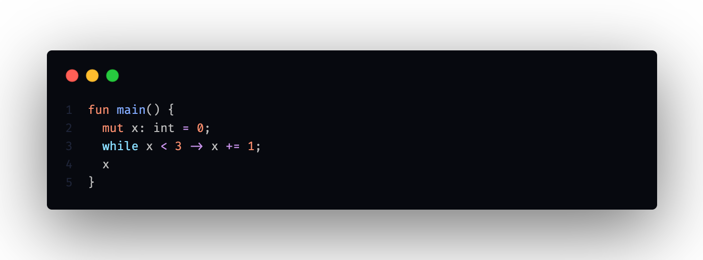
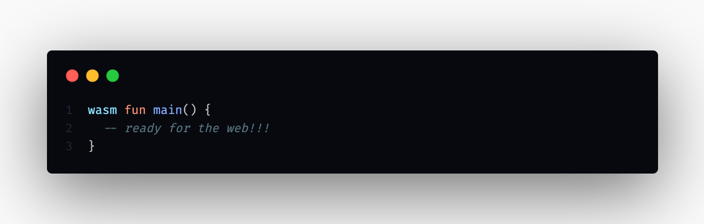
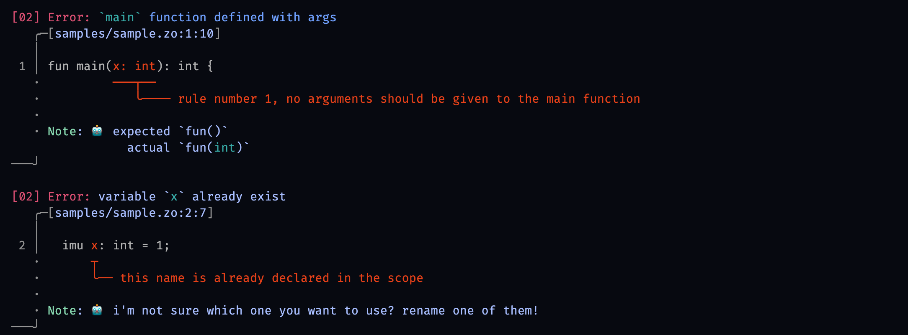

# zhoo

<p align="center">
  
</p>

...

## overview

- statically-typed language
- `hindley milner` type inference
- high performance
- `cranelift` and `llvm` backend (dev and release)
- user-friendly report messages via `ariadne`
- small binaries
- metaprogramming
- fast compilation time
- turing complete

## fresh syntax

zhoo's syntax is innovative, compact, elegant and cames with nice features. keywords are clear and have only one role. no doubt about the choice of implementation. in terms of syntactic sugar, one-liners will appreciate arrow loops (i.e. `while x < 3 -> x += 1;`), fans of ternary operations will be served with `when` expression (i.e `when true ? 1 : 2;`) but beware, type checking will throw an error if abused with nested ternary operations. `is` the keyword that means well: `x is enum::Foo` will be your best friend.

### arrow loops

**while**

<p align="center">
  
</p>

**loop**

<p align="center">
  
</p>

## currying

<p align="center">
  
</p>

## fizz buzz

<p align="center">
  
</p>

## embedded unit testing

a good way to do unit tests with functionality adapted to the comfort of the programmer. logic and testing in the same file, to change files as little as possible: very useful for tdd enthusiasts.

<p align="center">
  
</p>

## easy webassembly

bring your program to the web will be super simple. add the `wasm` keyword et voilà!

<p align="center">
  
</p>

## error messages

`zhoo` offers nice error messages, the reports are clear and rich to help the programmer understand what is wrong with the program. the graphical aspect of the errors allows people with disabilities *(e.g. colour blind)* not to lose visibility. the `zhoo` compiler is your best buddy and your first choice ally.

<p align="center">
  
</p>

## compiler phases

for the moment the proof of concept has only three phases:

```
           |--------|            |----------|            |---------|
source --> | parser | -- ast --> | analyzer | -- ast --> | codegen | --> exe
           |--------|            |----------|            |---------|
```

## start

[rust](https://www.rust-lang.org/tools/install) and [cargo](https://doc.rust-lang.org/cargo/getting-started/installation.html) must be installed on your machine before.

### cli

| run       | description              | cmd                                                  | status |
|:----------|:-------------------------|:-----------------------------------------------------|:-------|
| `compile` | compile with `cranelift` | `cargo run -- compile --input <path>`                | ok     |
| `compile` | compile with `llvm`      | `cargo run -- compile --input <path> --backend llvm` | ko     |
| `run`     | run the program          | `cargo run -- run`                                   | ok     |

the compiler generates two files: `main.o` and `main` in the `./program` directory. the `main` file is an executable which will be run by the command: `cargo run -- run`.

### development

first, you need to clone the repo:

```
git clone https://github.com/monsieurbadia/zhoo.git
```

second, try to compile a simple program:

```
cargo run -- compile --input samples/sample.zo
```

the ouput must looks like that:

```
compiling the program

╭
│ [make] dir: `program`
⋮ [make] obj: `program/main.o`
│ [make] exe: `program/main`
╰

✨ compile `<program-name>` successfully
```

check that you have the those files:
  - `target/debug/libzhoo_core.a`
  - `program/main.o`
  - `program/main`

then:

```
cargo run -- run
```

your output should looks like this:   

```
running the program

hello, hello! 👽
```

👋 welcome to the zhoo gang   
🥳 *we are proud to have you as a member*   

## contribution

contributions are welcome. know that there are no small contributions, so don't hesitate. i look forward to working with you.

if you have any questions, feel free to join the `zhoo` gang [discord](https://discord.gg/5dBTWgvb).

## license

[MIT](./LICENSE)
